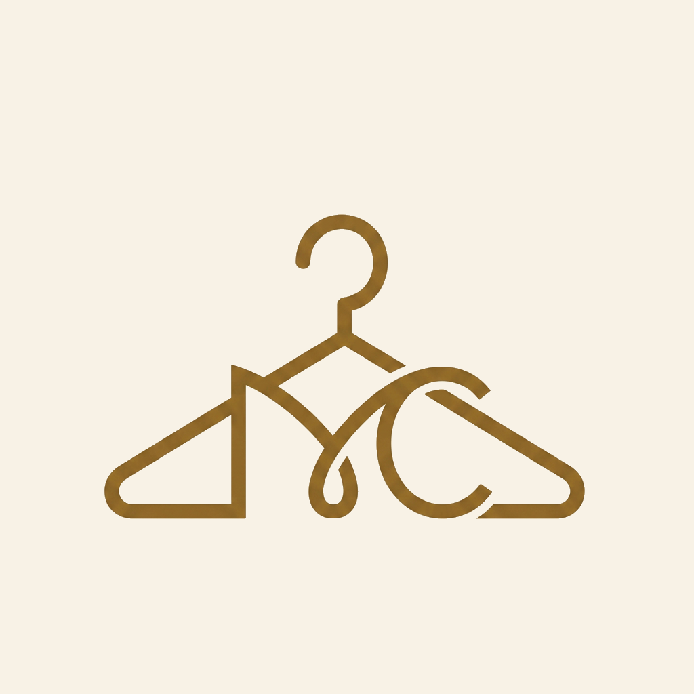

  

# MyCombine

MyCombine, dolabınızı dijital olarak düzenlemenize, kombin planlamanıza ve alışveriş kararlarınızı daha bilinçli vermenize yardımcı olan AI destekli bir stil asistanıdır.

## Ne İşe Yarar?

- Kıyafetlerinizi fotoğraf, kategori, renk, mevsim ve kullanım alanıyla kaydetmenize yardımcı olur.
- Dolabınızdaki parçaları daha kolay görmenizi ve günlük kombinler oluşturmanızı sağlar.
- AI destekli kıyafet analiziyle yeni parçaları daha hızlı etiketlemeyi hedefler.
- Seçtiğiniz kıyafet ve aksesuarları kendi fotoğrafınız üzerinde sanal deneme deneyimiyle önizlemenize yardımcı olur.
- Alışveriş sepetindeki ürünleri mevcut dolabınızla karşılaştırarak daha bilinçli satın alma kararları vermenizi destekler.
- Seyahatlerde hava durumuna göre Akıllı Valiz planlaması sunar.

## Odak Noktaları

- Dijital dolap yönetimi
- AI destekli kombin önerileri
- Sanal kıyafet deneme deneyimi
- Alışveriş analizi
- Seyahat ve valiz planlama
- Gizlilik odaklı kullanıcı deneyimi

## Gizlilik Yaklaşımı

MyCombine, dolap ve profil verilerini mümkün olduğunca cihaz odaklı ele alacak şekilde tasarlanmıştır. AI analizi veya sanal deneme gibi özelliklerde yalnızca kullanıcının seçtiği içerikler işlenir.

## Durum

MyCombine iOS uygulaması geliştirme aşamasındadır. Bu public repo yalnızca ürün tanıtımı ve marka bilgisi içindir; uygulama kaynak kodu burada paylaşılmaz.
