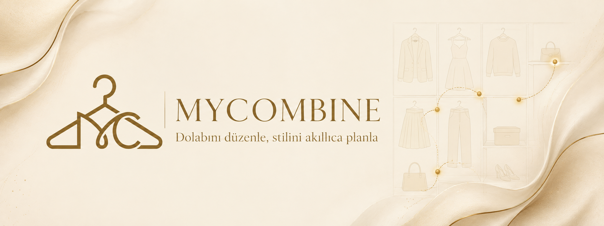

<h1 align="center">MyCombine</h1>

  <strong>Dijital dolap, AI destekli kombin planlama ve bilinçli alışveriş için kişisel stil asistanı.</strong>

  
  
  
  

## Ürün özeti

| | |
| --- | --- |
| **Problem** | Dolaptaki parçaları hatırlamak, uyumlu kombin kurmak ve yeni alışverişi değerlendirmek zorlaşabiliyor. |
| **Çözüm** | Kıyafet envanterini, kombin önerilerini ve satın alma kararlarını tek kişisel stil akışında birleştirmek. |
| **Öne çıkan deneyim** | Sanal deneme, alışveriş sepeti analizi ve hava durumuna göre Akıllı Valiz. |
| **Gizlilik yaklaşımı** | Dolap ve profil verilerini cihaz odaklı ele almak; yalnızca seçilen içeriği analiz etmek. |

## Stil akışı

1. **Dolabını oluştur** — parçaları fotoğraf, kategori, renk, mevsim ve kullanım alanıyla kaydet.
2. **Kombinle** — mevcut parçalar arasından uyumlu görünümler planla.
3. **Önizle** — seçilen kıyafet ve aksesuarları sanal deneme ile değerlendir.
4. **Karşılaştır** — alışveriş sepetini dolabındaki parçalarla birlikte düşün.
5. **Hazırlan** — seyahat ve hava durumuna göre Akıllı Valiz oluştur.

## Odak noktaları

- AI destekli kıyafet analizi ve hızlı etiketleme
- Dijital dolap ve kullanım bağlamı yönetimi
- Günlük kombin önerileri
- Sanal kıyafet deneme deneyimi
- Dolapla bağlantılı alışveriş analizi
- Seyahat ve valiz planlama

## Durum

MyCombine iOS uygulaması geliştirme aşamasındadır.
